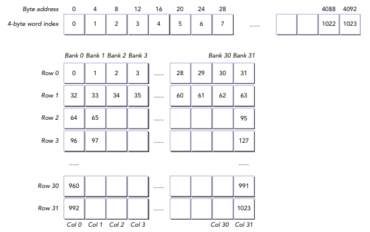

# Resumen 3 / Professional CUDA C Programming
## 'Checking the data layout of shared memory'

Esta seccion detalla como utilizar la memoria compartida de manera efectiva, utilizando comparaciones de estructuras de datos y conceptos basicos que uno debe tomar en cuenta al desarrolar programas que utilizen memoria compartida.
Especificamente:
- Arreglos cuadrados y arreglos rectangulares
- Acceso de fila mayor y columna mayor
- Declaraciones dinamicas y estaticas
- Alcance de archivo y kernel
- Con y sin desplazamiento de memoria

La gestión de memoria compartida es una característica importante de CUDA que unifica la memoria del host (CPU) y del device (GPU) en un solo espacio de direcciones. Esto permite acceder a punteros del host directamente desde los kernels que se ejecutan en el device.  Al igual que reduce la necesidad de transferir datos explícitamente entre CPU y GPU ya que ambos pueden acceder a los mismos buffers de memoria y simplifica el código al poder usar punteros regulares en los kernels.

## Memoria Compartida en configuración cuadrada:
El primer apartado de la seccion habla sobre el uso de memoria compartida en una configuracion de matriz cuadrada, la cual debido a su simplicidad hace facil calcular desplazamientos de memoria 1D (unidimensionales) dentro de indices de hilos 2D.
La variable de memoria compartida de dos dimensiones de puede declarar en un codigo de la siguiente manera: `__shared__ int tile [N] [N] ;`, lo importante de esta declaracion de memoria, siendo una configuracion cuadrada, es que se puede acceder a ella desde un bloque de hilos cuadrado, con los hilos vecinos accediendo a los valores vecinos en las dimensiones `x` o `y` de la siguiente manera:

* `tile [threadIdx.y] [threadIdx.x]` / Accede a los valores vecinos de una fila (x)
* `tile [threadIdx.x] [threadIdx.y]` / Accede a los valores vecinos de una columna (y)

Ya que acceder a valores del mismo banco en diferentes filas causa un conflicto, disminuyendo la eficiencia del programa dado que tiene que dividir y repetir la solicitud de los hilos correspondientes en cuantos ciclos sean necesarios, podemos determinar que el metodo de acceso `tile [threadIdx.y] [threadIdx.x]` es mas eficiente dado que accede a valores en diferentes bancos en la misma fila.

## Acceso en orden principal de fila y principal de columna:
Estos son metodos para almacenar arreglos multidimensionales en almacenamiento lineal como la RAM, cuya diferencia entre ambos son los elementos que son vecinos en memoria.

Demostrado en la imagen, de acuerdo al orden de acceso a los valores vecinos el metodo de orden de fila es más eficiente y resulta en menos conflictos de bancos a la hora de acceder a los datos dentro de la matriz a diferencia de su contraparte de acceso de orden de columna el cual debido a su 'verticalidad' de proceso o acceso a diferentes filas de un mismo banco de datos, lo cual resultaria en multiples conflictos a la hora de acceder a los datos.

## Escritura en orden principal de fila y principal de columna:
Bajo la misma logica del proceso pasado, la escritura de datos en una matriz a traves de los diferentes metodos, el orden de fila resulta nuevamente en una mayor eficiencia y menos conflictos debido a su acceso de misma fila y diferente banco, a diferencia de su contraparte.

## Memoria dinamica compartida:
Esta es memoria que se declara en el tiempo de ejecucion del proceso, esto resulta en mayor eficiencia en los procesos de escritura y acceso de datos, al igual que en asignación de memoria.
Esto lo puedes hacer tanto fuera del kernel para hacerlo global al alcance del archivo, o dentro del kernel para restringirlo a un alcance de kernel.

La memoria compartida dinámica debe ser declarada como un arreglo de una dimensión sin tamaño, por lo tanto, debes calcular los índices de acceso a la memoria en base a los índices de hilos 2D.

## Desplazando memoria compartida estatica delcarada
Para resolver conflictos de bancos de memeria de una memoria compartida rectangular, podemos utilizar el padding. Sin embargo, para dispositivos Kepler debes calcular cuantos elementos de padding son necesarios.
Para declarar el padding estático en la memoria compartida se realiza así:
* `__shared__ int tile[BDIMY][BDIMX + NPAD];`
Cambiar el número de elementos de padding resulta en un reporte de que las operaciones de carga de la memoria compartida son atendidos por dos transacciones, lo que significa, un conflicto de banco de memoria de dos direcciones.

## Desplazando memoria compartida dinamica declarada
El desplazamiento también puede ser utilizado por kernels que utilicen memoria compartida dinámica rectangular. Como el padding de la memoria compartida y la memoria global tendrán diferentes tamaños,
Se deben mantener tres índices por cada hilo del kernel:
* `row_idx`: Indice de fila para el padding de la memoria compartida. Al usar este índice, el warp puede acceder a una fila de la matriz.
* `col_idx`: Indice de columna para el padding de la memoria compartida. Al usar este índice, el warp puede acceder a una columna de la matriz.
* `g_idx`: Indice a la memoria global lineal. Al usar este índice, un warp puede fucionar accesos a la memoria global.
 
## Reduciendo el acceso a la memoria global
Una de las principales razones para utilizar la memoria compartida, es para almacenar datos en la caché del chip. De esta forma reducimos la cantidad de accesos a la memoria global en nuestro kernel. 
El objetivo es reducir los accesos a la memoria global al utilizar la memoria compartida como una caché administrada por el programa.
